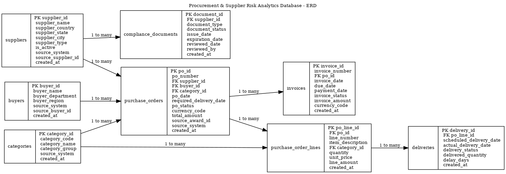

# Procurement & Supplier Risk Analytics Database

## Project Overview

This project builds a PostgreSQL relational database for procurement and supplier risk analytics.

It analyzes supplier spend, purchase orders, purchase order lines, delivery performance, invoices, buyer activity, category spend, compliance document status, and supplier risk scoring.

The project uses public procurement award data from USAspending.gov as the source foundation and generates synthetic operational records for delivery, invoice, and compliance workflows that are not publicly available in public procurement datasets.

## Business Problem

Procurement, supply chain, and compliance teams need visibility into supplier spend exposure, late delivery risk, open purchase order aging, invoice status, expired or missing compliance documents, spend by category, monthly purchasing trends, and supplier risk prioritization.

This database converts public procurement award data into business KPIs that can support supplier review, procurement planning, compliance monitoring, and executive reporting.

## Data Strategy

Public USAspending award data is used for suppliers, buyers, award identifiers, spend amounts, award descriptions, contract dates, and procurement categories derived from public text fields.

The following operational tables are synthetically generated using documented business rules:

- purchase_order_lines
- deliveries
- invoices
- compliance_documents

These records are synthetic because real private-sector delivery, invoice, and compliance document records normally live inside ERP systems such as SAP, Oracle, Coupa, Ariba, or NetSuite.

## Data Ethics

This project does not use confidential employer data.

Any delivery performance, invoice status, compliance document status, or supplier risk scoring data is synthetic and generated only for portfolio demonstration.

## Database Tables

- suppliers
- buyers
- categories
- purchase_orders
- purchase_order_lines
- deliveries
- invoices
- compliance_documents

## Business Views

- vw_supplier_spend_summary
- vw_spend_by_category
- vw_monthly_purchasing_trend
- vw_late_delivery_performance
- vw_open_po_aging
- vw_supplier_compliance_status
- vw_supplier_risk_score

## Entity Relationship Diagram

The database model includes supplier master data, buyers, categories, purchase orders, purchase order lines, deliveries, invoices, and compliance documents.

## Result Outputs

The project includes saved query outputs for review:

- [KPI Query Results](docs/results/kpi_query_results.txt)
- [Database Load Validation](docs/results/database_load_validation.txt)

## Excel Analytics Report

The project also includes an Excel analytics report generated from dashboard-ready CSV exports.

- [Procurement Supplier Analytics Excel Report](reports/procurement_supplier_analytics_report.xlsx)

The Excel file includes multiple sheets for supplier risk, supplier spend, spend by category, monthly trends, late delivery performance, open PO aging, and compliance status.

## KPI Queries

The project includes final KPI queries for:

1. Top suppliers by total spend
2. Suppliers with most late deliveries
3. Open purchase orders by aging bucket
4. Suppliers with expired or missing compliance documents
5. Spend by category
6. Monthly purchasing trend
7. Supplier risk score
8. Overdue invoice exposure
9. Buyer spend summary
10. Executive procurement summary

## Technology Stack

- PostgreSQL
- SQL
- Python
- Pandas
- Requests
- GitHub Codespaces
- GitHub

## How to Run

Install Python dependencies:

python -m pip install -r requirements.txt

Extract public procurement award data:

python python/01_extract_usaspending_data.py

Transform raw award data:

python python/02_transform_procurement_data.py

Generate synthetic operational data:

python python/03_generate_synthetic_operations.py

Create PostgreSQL tables:

psql postgresql://procurement_user:procurement_pass@db:5432/procurement_analytics -f sql/01_create_tables.sql

Add constraints and indexes:

psql postgresql://procurement_user:procurement_pass@db:5432/procurement_analytics -f sql/03_constraints_indexes.sql

Load processed CSV data:

psql postgresql://procurement_user:procurement_pass@db:5432/procurement_analytics -f sql/02_load_data.sql

Create business views:

psql postgresql://procurement_user:procurement_pass@db:5432/procurement_analytics -f sql/04_business_views.sql

Run KPI queries:

psql postgresql://procurement_user:procurement_pass@db:5432/procurement_analytics -f sql/05_kpi_queries.sql

## Current Dataset Summary

| Table | Rows |
|---|---:|
| suppliers | 165 |
| buyers | 24 |
| categories | 9 |
| purchase_orders | 500 |
| purchase_order_lines | 1,982 |
| deliveries | 1,982 |
| invoices | 500 |
| compliance_documents | 990 |

## Resume Summary

Designed a PostgreSQL relational database using public procurement data to analyze supplier spend, purchase orders, delivery performance, invoices, compliance document status, and supplier risk scoring. Built SQL views and KPI queries for spend analysis, late deliveries, open PO aging, expired documents, monthly trends, and supplier risk prioritization.

## Interview Talking Point

This project demonstrates the ability to design a relational database, transform public procurement data into a business model, generate realistic synthetic operational data, enforce data quality through constraints, optimize analytical queries with indexes, and build procurement KPIs that support supplier risk analysis.
